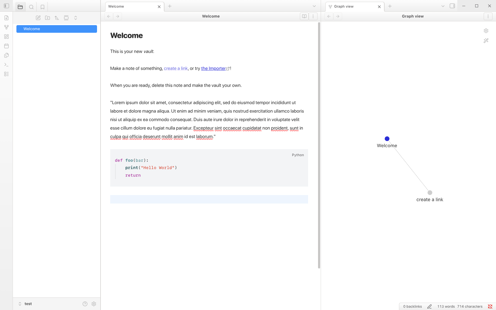
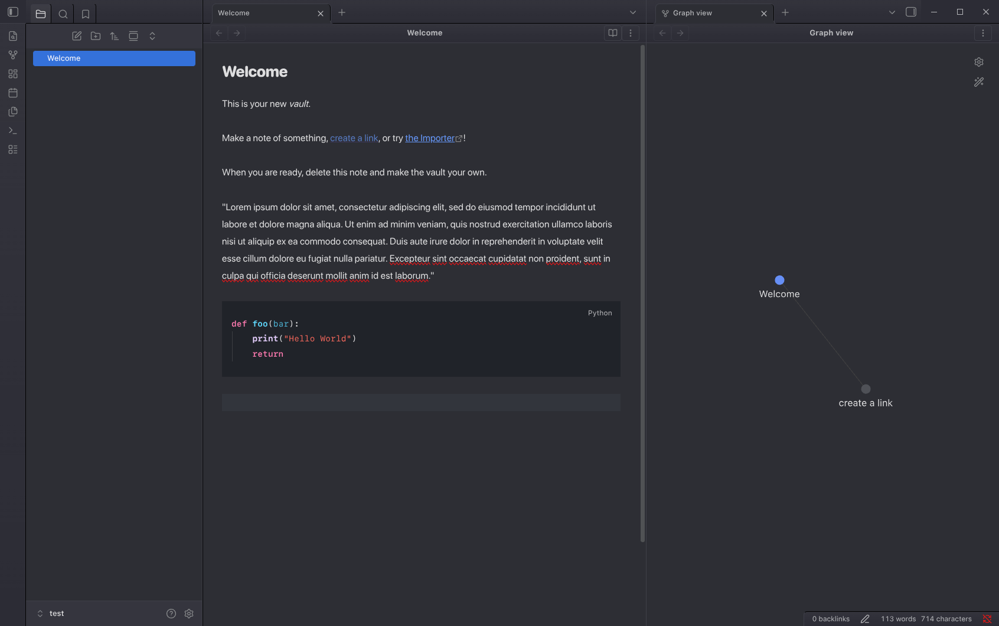

# Xcode Classic for Obsidian

A port of the Xcode Classic look for [Obsidian](https://obsidian.md). This theme is designed to feel close to the [Xcode Theme for VS Code](https://github.com/MateoCerquetella/xcode-theme), while adapting the layout and code styling to Obsidian. It supports both light and dark modes.

#### Dark Bordered

#### Light Bordered

## Features

* **Xcode-Inspired Palette:** Light and dark UI colours are derived from the Xcode Classic VS Code theme.
* **Distinct Code Blocks:** Code blocks use stronger panel contrast so they read clearly against Obsidian's editor background.
* **Xcode Syntax Highlighting:** Keywords, strings, comments, functions, types, and operators are mapped to Xcode-style colours in code blocks.
* **Apple Font Stack:** Interface text uses SF Pro, body text uses SF Pro Rounded/SF Pro, and code prefers SF Mono.

## Installation

### Manual Installation

1. Download the theme files, including `theme.css` and `manifest.json`.
2. Open your Obsidian vault folder.
3. Navigate to `.obsidian/themes/`.
4. Create a new folder named `Obsidian-Xcode-Classic-Theme`.
5. Paste the files into that folder.
6. Open Obsidian Settings > Appearance > Themes and select `Obsidian-Xcode-Classic-Theme`.

### Updates

This theme is currently maintained manually. If you encounter issues with specific plugins, please open an issue on this repository.

## Note

If you're planning to use this on a non-macOS computer, you'll need to download and install the Apple SF themes from [here](https://developer.apple.com/fonts/).

## Credits & License

This project is a port inspired by the [Xcode Theme for VS Code](https://github.com/MateoCerquetella/xcode-theme).

* **Original Author:** [Mateo Cerquetella](https://github.com/MateoCerquetella)
* **License:** Follow the upstream theme license and any licensing you choose for this Obsidian port.
